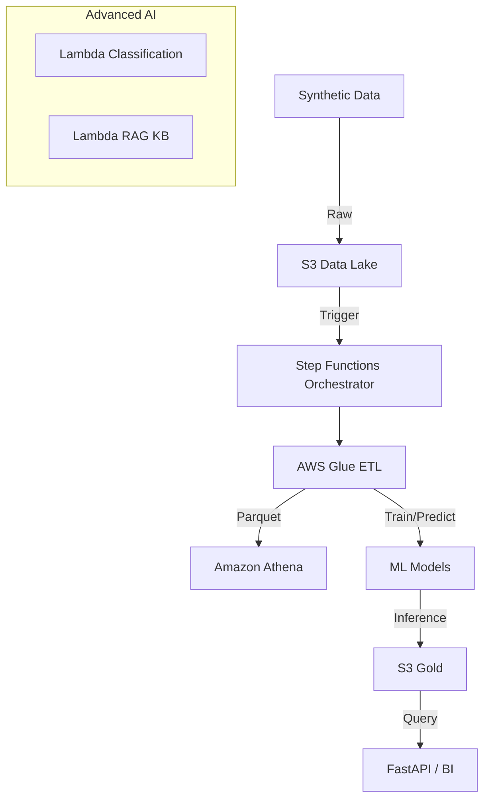

# Healthcare Operations Data & AI Platform (AWS Serverless)

Plataforma de dados e IA para eficiência operacional em saúde, focada em previsão de lotação e tempo de espera. Arquitetura Serverless na AWS com ETL robusto e módulos de IA generativa.

## 🏗 Arquitetura

A solução utiliza uma arquitetura de Data Lake em camadas (Bronze/Silver/Gold) orquestrada por Step Functions.



## 📚 Decisões de Arquitetura (Guia de Estudo)

Este projeto foi desenhado para demonstrar uma arquitetura de dados moderna, escalável e de baixo custo operacional (Serverless). Abaixo, a explicação do "porquê" de cada componente:

### 1. Data Lakehouse (S3 + Athena)
*   **Por que S3?** Diferente de bancos tradicionais, o S3 separa armazenamento de processamento. É infinitamente escalável e muito barato.
*   **Camadas (Medallion Architecture)**:
    *   **Bronze (Raw)**: Cópia fiel da origem. Se errarmos a transformação, podemos sempre reprocessar a partir daqui.
    *   **Silver (Clean)**: Dados limpos, tipados e deduplicados. Aqui aplicamos Schemas.
    *   **Gold (Curated)**: Dados agregados (KPIs) prontos para consumo.
*   **Por que Athena?** Permite rodar SQL diretamente nos arquivos do S3 (Serverless). Evita o custo de manter um Data Warehouse (como Redshift) ligado 24/7 para volumes pequenos/médios.

### 2. Processamento (AWS Glue)
*   **Spark vs Python Shell**:
    *   Usamos **Glue PySpark** para transformações pesadas (Silver/Gold) porque o Spark distribui o processamento em vários nós (cluster).
    *   Usamos **Glue Python Shell** para tarefas leves (Ingestão, Inferência ML simples) porque custa uma fração do preço do Spark e liga muito mais rápido.

### 3. Orquestração (Step Functions vs Airflow)
*   Para este MVP, escolhemos **Step Functions** porque é totalmente nativo AWS e Serverless.
*   **Airflow (MWAA)** seria excelente para fluxos muito complexos, mas exige que você pague por servidores "ligados" o tempo todo. O Step Functions cobra por transição de estado, sendo ideal para pipelines event-driven.

### 4. Machine Learning & IA
*   **Scikit-Learn no Glue**: Para modelos tabulares leves, rodar dentro do próprio ETL simplifica a infraestrutura (sem necessidade de SageMaker Endpoints caros para inferência batch).
*   **OpenAI + Lambda**: Delegamos a inteligência de NLP (texto) para LLMs via API. O Lambda atua apenas como um "proxy" leve, mantendo o custo muito baixo (pagamento por milissegundo de execução).

## 🚀 Como Executar

### Pré-requisitos
- Python 3.9+
- Conta AWS configurada (AWS CLI)
- Terraform (para deploy da infraestrutura)
- OpenAI API Key

### 1. Instalação Local (Simulação)
Para rodar o pipeline completo localmente (sem AWS):

```bash
# Criar ambiente virtual
python -m venv .venv
.venv\Scripts\Activate.ps1

# Instalar dependências
pip install -r requirements.txt

# Executar Pipeline Local
python run_local_pipeline.py
```

Isso irá gerar uma pasta `data_local/` com os arquivos parquet das camadas Bronze, Silver e Gold, além de executar o treino e inferência do modelo.

### 2. Deploy na AWS (Infraestrutura)
```bash
cd infra
terraform init
terraform apply -var="openai_api_key=sk-..."
```
Isso criará: S3 Buckets, Glue Jobs, Step Functions, Lambdas e Secrets.

### 3. Deploy do Código (ETL & AI)
Os scripts em `src/` devem ser zipados e enviados para o S3 de artefatos (gerenciado pelo Terraform/CI CD pipeline).

## 📂 Estrutura do Projeto
- `infra/`: Código Terraform (IaC).
- `src/data_gen/`: Gerador de dados sintéticos.
- `src/etl/`: Scripts Glue (Ingestão, Limpeza, Qualidade).
- `src/ml/`: Scripts de Treino e Inferência.
- `src/ai/`: Lambdas de IA Avançada (Classificação, RAG).
- `src/ddl/`: Scripts SQL para Athena.
- `runbook.md`: Guia de Operação e Resposta a Incidentes.

## 📖 Documentação Adicional
- [Runbook Operacional](./runbook.md)
- [Dicionário de Dados](./data_dictionary.md) (Artifact)

## 💡 Conceitos de Dados & Nomenclatura

Para facilitar consultas futuras e expansáo, adotamos convenções de Engenharia de Dados e MLOps. Abaixo, o significado dos principais campos:

### `sector_id` (Identificador da Entidade)
*   **Significado**: ID do Setor Hospitalar (ex: Emergency, Pediatrics).
*   **Por que "_id"?**: O sufixo `_id` indica que campo é uma chave de busca ou agrupamento (Foreign Key), facilitando joins com tabelas de dimensão (ex: para pegar o nome do gerente do setor).

### `prediction_ts` (Timestamp de Referência)
*   **Significado**: A data e hora exata em que o modelo **executou** a previsão.
*   **Importância**: Diferente do "target time" (para *quando* é a previsão), este campo permite auditar a performance do modelo ao longo do tempo (Model Monitoring). Permite responder: "O que o modelo achava que ia acontecer há 3 horas atrás?".

### `predicted_arrivals_h1` (Target + Horizonte)
*   **Estrutura**: `[tipo]_[metrica]_[horizonte]`
    *   **predicted**: Valor estimado pelo modelo.
    *   **arrivals**: A métrica de negócio.
    *   **h1**: Horizonte de 1 hora.
*   **Expansão**: Para adicionar previsões de 4 ou 24 horas, basta criar colunas `predicted_arrivals_h4` e `predicted_arrivals_h24`. O formato *wide* facilita a criação de dashboards comparativos.

## 🔮 Possibilidades de Expansão (Estudo)

1.  **Dashboards de BI (Amazon QuickSight / PowerBI)**:
    *   Conectar ao Athena e criar gráficos de **Previsto vs Real** usando `prediction_ts` para alinhar as janelas de tempo.
2.  **Monitoramento de Model Drift**:
    *   Criar um Job Glue que compara a distribuição estatística de `predicted_arrivals_h1` da semana passada com a atual para detectar anomalias.
3.  **Feature Store**:
    *   Evoluir a tabela `silver` para uma Feature Store dedicada (ex: AWS Feature Store) para reutilizar features de `rolling_avg` em outros modelos.
